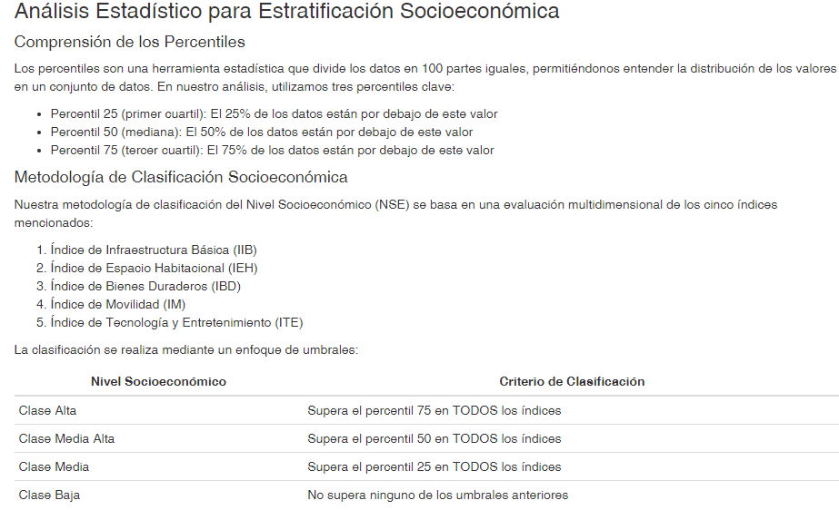
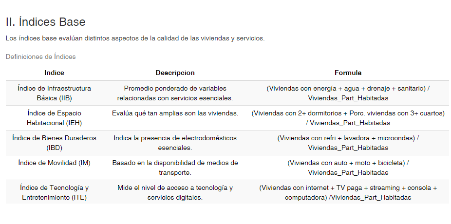
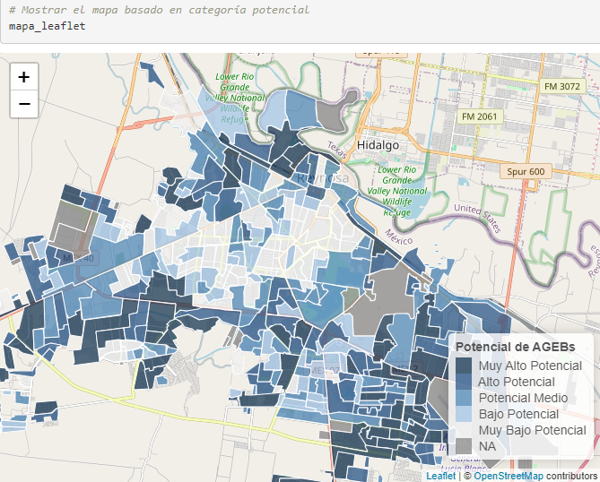
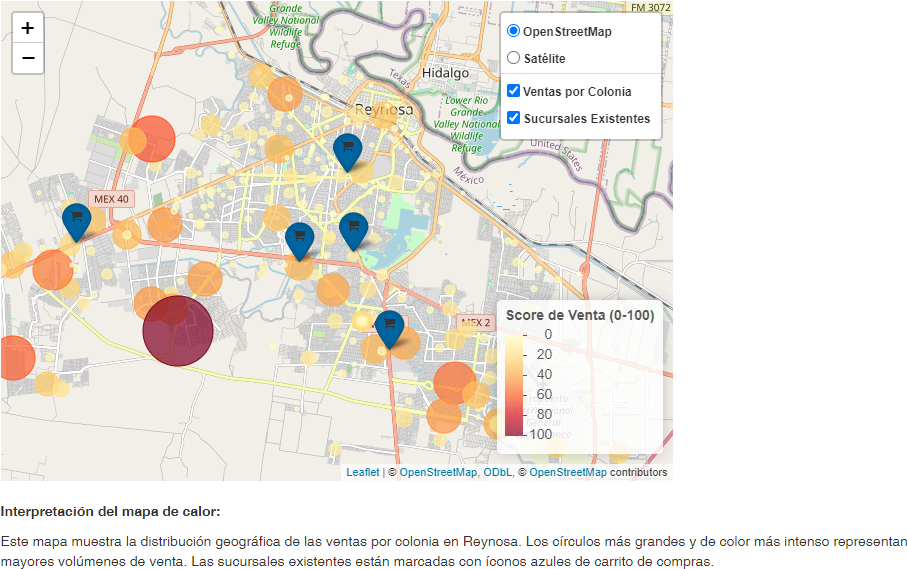
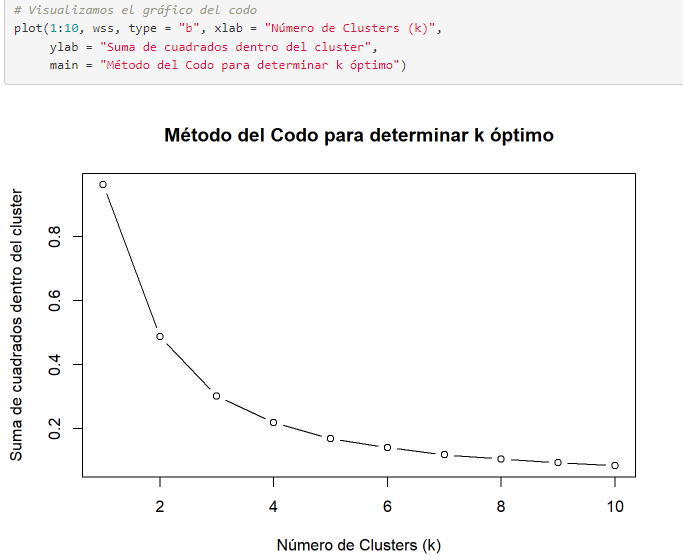
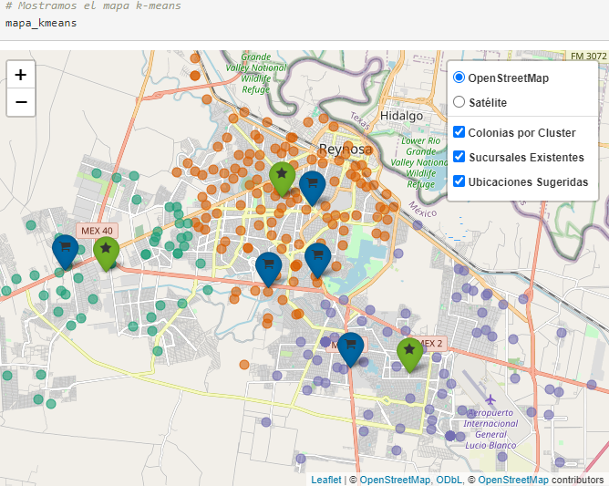
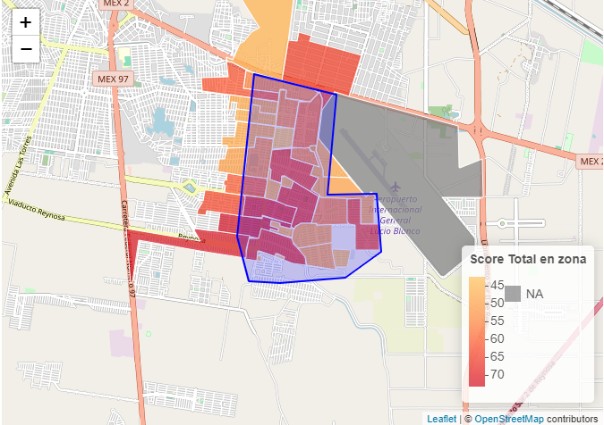
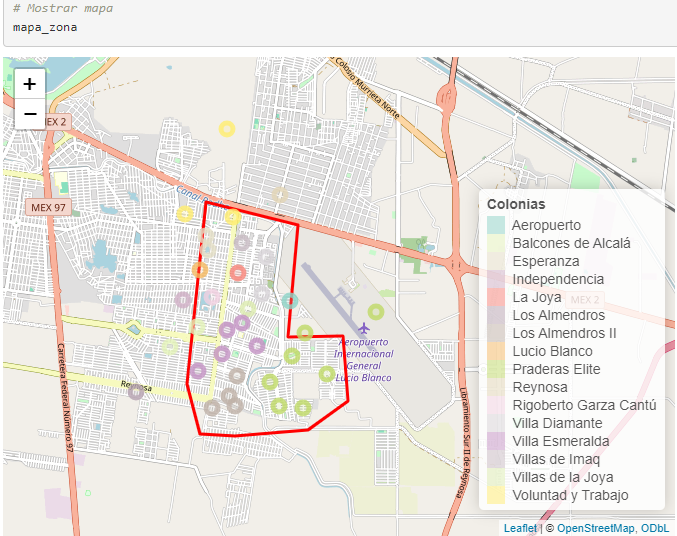

# Venta-Geoespacial
Análisis geoespacial de AGEBs en Reynosa para identificar ubicaciones óptimas de sucursales usando clustering K-means y datos socioeconómicos

---

## ⚠️ Confidencialidad y naturaleza de los datos

> **Nota:**  
> Los datos y visualizaciones presentados han sido **modificados y adaptados para fines ilustrativos**, asegurando la **confidencialidad de la información sensible y comercial**.  
> No se comparten archivos de datos originales. Todos los outputs visuales son capturas de resultados generados con datos anonimizados o alterados.

---

## 📌 Presentación del análisis y visión

Este proyecto explora el potencial del análisis espacial y comercial usando **R, visualización avanzada y técnicas de machine learning**.  
Se centra en la ciudad de Reynosa, Tamaulipas, México, con el objetivo de **identificar zonas óptimas para futuras aperturas**, integrando datos socioeconómicos del INEGI (Censo 2020) y ventas comerciales.

> **Visión personal:**  
> Mi objetivo con este trabajo fue mostrar el potencial de las herramientas de análisis de datos (RStudio, ML, APIs) en un entorno donde normalmente no se exploran.  
> Espero que esto sirva para **inspirar la creación de un área profesional de analítica de datos** en la organización y fomente una cultura basada en datos.

---

## 🔒 Sobre el código y outputs

- El **archivo `analisis_agebs_reynosa.Rmd`** contiene el flujo completo del análisis en R.
- **No se incluyen datos crudos ni procesados**; solo outputs visuales en la carpeta `/Ventas_AGEBS`.
- Si deseas reproducir el flujo, puedes consultar el código, adaptando tus propios datos.

---

## 🗂️ Outputs visuales del análisis

### 1. Tabla de clasificación socioeconómica (NSE)


### 2. Tabla de componentes del score total


### 3. Tabla de índices base


### 4. Mapa potencial de AGEBs por categoría


### 5. Mapa de calor basado en score total


### 6. Mapa de ventas (heatmap interactivo)


### 7. Gráfico del método del codo (k óptimo)


### 8. Visualización de clusters y sucursales


### 9. Geocodificación inversa para AGEBs de interés (colonias identificadas)


### 10. Geocodificación inversa para AGEBs de interés (colonias identificadas2)


---

## 🧑‍💻 Ejemplos representativos de código

### Clusterización K-means y método del codo

```r
# Determinar número óptimo de clusters (método del codo)
wss <- numeric(10)
for (i in 1:10) {
  km.out <- kmeans(datos_coordenadas[, c("longitud", "latitud")], centers = i, nstart = 25)
  wss[i] <- km.out$tot.withinss
}
plot(1:10, wss, type = "b", xlab = "Clusters (k)", ylab = "WSS")

# Ejecutar k-means
set.seed(123)
k <- 3
km <- kmeans(datos_coordenadas[, c("longitud", "latitud")], centers = k, nstart = 25)
```
### Geocodificación inversa con Google Maps API
```r
Copiar
Editar
library(ggmap)
register_google(key = "TU_API_KEY")
df_coords <- data.frame(lat = ..., lon = ...)
df_coords$direccion <- mapply(function(lat, lon) {
  revgeocode(c(lon, lat), output = "address")
}, df_coords$lat, df_coords$lon)
```
### Visualización de mapas interactivos con Leaflet
```r
Copiar
Editar
library(leaflet)
leaflet(data) %>%
  addProviderTiles(providers$OpenStreetMap) %>%
  addCircleMarkers(lng = ~longitud, lat = ~latitud, radius = ~sqrt(valor)/10)
```
🚀 Reflexiones, aprendizajes y proceso de exploración autodidacta

Este proyecto es iniciativa personal y ejemplo de aprendizaje autodidacta, sin experiencia previa formal en machine learning ni desarrollo avanzado de visualizaciones en R.

El flujo completo fue posible gracias al apoyo de inteligencia artificial generativa (ChatGPT, Claude), investigación, y la integración de recursos modernos (APIs, librerías R).

Aprendí sobre el uso práctico de métodos de clustering (k-means), el método del codo, integración de geocodificación inversa y visualización avanzada para problemas reales de negocio.

Espero que este trabajo inspire y motive a profesionalizar la analítica de datos y el uso de tecnología en la organización.

## 📧 Contacto

reyes061295@gmail.com  
[LinkedIn](https://www.linkedin.com/in/marb951206/) | [GitHub](https://github.com/mreyes-analytics)


