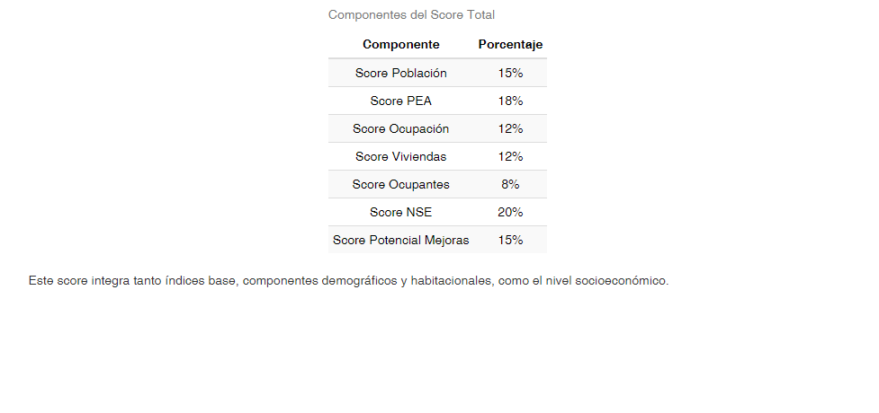
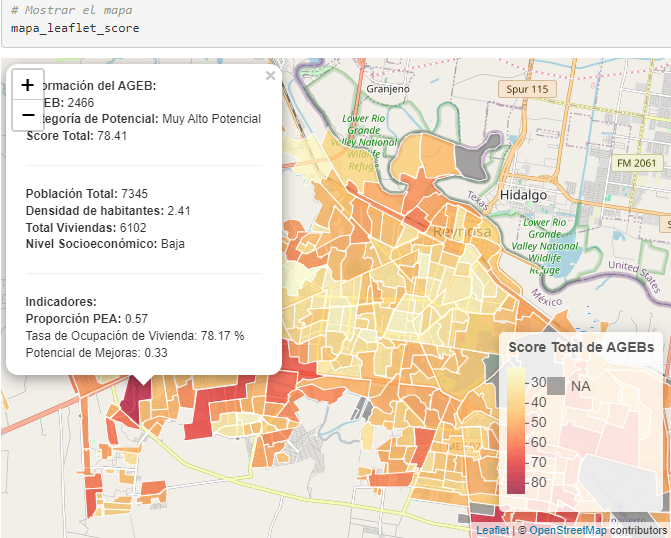

# Venta-Geoespacial
Análisis geoespacial de AGEBs en Reynosa para identificar ubicaciones óptimas de sucursales usando clustering K-means y datos socioeconómicos

## 🔗 Proyecto relacionado

Este análisis es una **continuación del primer repositorio** sobre el análisis demográfico del censo de población y vivienda en Reynosa, disponible aquí:  
[Análisis Demográfico Reynosa](https://github.com/mreyes-analytics/analisis-censo-reynosa)

---

## ⚠️ Confidencialidad y naturaleza de los datos

> **Nota:**  
> Los datos y visualizaciones presentados han sido **modificados y adaptados para fines ilustrativos**, asegurando la **confidencialidad de la información sensible y comercial**.  
> No se comparten archivos de datos originales. Todos los outputs visuales son capturas de resultados generados con datos anonimizados o alterados.

---

## 📌 Presentación del análisis y visión

Este proyecto explora el potencial del análisis espacial y comercial usando **R, visualización avanzada y técnicas de machine learning**.  
Se centra en la ciudad de Reynosa, Tamaulipas, México, con el objetivo de **identificar zonas óptimas para futuras aperturas**, integrando datos socioeconómicos del INEGI (Censo 2020) y ventas comerciales.

> **Visión personal:**  
> Mi objetivo con este trabajo fue mostrar el potencial de las herramientas de análisis de datos (RStudio, ML, APIs) en un entorno donde normalmente no se exploran.  
> Espero que esto sirva para **inspirar la creación de un área profesional de analítica de datos** en la organización y fomente una cultura basada en datos.

---

## 🔒 Sobre el código y outputs

- El **archivo `analisis_agebs_reynosa.Rmd`** contiene el flujo completo del análisis en R.
- **No se incluyen datos crudos ni procesados**; solo outputs visuales en la carpeta `/Ventas_AGEBS`.
- Si deseas reproducir el flujo, puedes consultar el código, adaptando tus propios datos.

---

## 🗂️ Outputs visuales del análisis

### 1. Tabla de clasificación socioeconómica (NSE)


### 2. Tabla de componentes del score total


### 3. Tabla de índices base


### 4. Mapa potencial de AGEBs por categoría


### 5. Mapa de calor basado en score total


### 6. Mapa de ventas (heatmap interactivo)


### 7. Gráfico del método del codo (k óptimo)


### 8. Visualización de clusters y sucursales


### 9. Geocodificación inversa para AGEBs de interés (colonias identificadas)


### 10. Geocodificación inversa para AGEBs de interés (colonias identificadas2)


---

## 🧑‍💻 Ejemplos representativos de código

### Clusterización K-means y método del codo

```r
# Determinar número óptimo de clusters (método del codo)
wss <- numeric(10)
for (i in 1:10) {
  km.out <- kmeans(datos_coordenadas[, c("longitud", "latitud")], centers = i, nstart = 25)
  wss[i] <- km.out$tot.withinss
}
plot(1:10, wss, type = "b", xlab = "Clusters (k)", ylab = "WSS")

# Ejecutar k-means
set.seed(123)
k <- 3
km <- kmeans(datos_coordenadas[, c("longitud", "latitud")], centers = k, nstart = 25)
```
### Geocodificación inversa con Google Maps API
```r
Copiar
Editar
library(ggmap)
register_google(key = "TU_API_KEY")
df_coords <- data.frame(lat = ..., lon = ...)
df_coords$direccion <- mapply(function(lat, lon) {
  revgeocode(c(lon, lat), output = "address")
}, df_coords$lat, df_coords$lon)
```
### Visualización de mapas interactivos con Leaflet
```r
Copiar
Editar
library(leaflet)
leaflet(data) %>%
  addProviderTiles(providers$OpenStreetMap) %>%
  addCircleMarkers(lng = ~longitud, lat = ~latitud, radius = ~sqrt(valor)/10)
```
🚀 Reflexiones, aprendizajes y proceso de exploración autodidacta

Este proyecto es iniciativa personal y ejemplo de aprendizaje autodidacta, sin experiencia previa formal en machine learning ni desarrollo avanzado de visualizaciones en R.

El flujo completo fue posible gracias al apoyo de inteligencia artificial generativa (ChatGPT, Claude), investigación, y la integración de recursos modernos (APIs, librerías R).

Aprendí sobre el uso práctico de métodos de clustering (k-means), el método del codo, integración de geocodificación inversa y visualización avanzada para problemas reales de negocio.

Espero que este trabajo inspire y motive a profesionalizar la analítica de datos y el uso de tecnología en la organización.

## 📧 Contacto

reyes061295@gmail.com  
[LinkedIn](https://www.linkedin.com/in/marb951206/) | [GitHub](https://github.com/mreyes-analytics)

# Geospatial Sales Analysis

Geospatial analysis of AGEBS (Basic Geostatistical Areas) in Reynosa, aimed at identifying optimal store locations using K-means clustering and socioeconomic data.

---

## ⚠️ Data Confidentiality and Nature

> **Note:**  
> The data and visualizations presented here have been **modified and adapted for illustrative purposes**, ensuring the **confidentiality of sensitive and commercial information**.  
> No original data files are shared. All visual outputs are screenshots generated with anonymized or altered data.

---

## 📌 Project Overview and Vision

This project explores the potential of spatial and commercial analysis using **R, advanced visualization, and machine learning techniques**.  
The focus is the city of Reynosa, Tamaulipas, Mexico, with the objective of **identifying optimal areas for future store openings**, integrating socioeconomic data from INEGI (2020 Census) and commercial sales data.

> **Personal Vision:**  
> My goal with this work was to showcase the potential of data analysis tools (RStudio, ML, APIs) in an environment where they are not commonly used.  
> I hope this serves to **inspire the creation of a professional data analytics area** within the organization and foster a data-driven culture.

---

## 🔒 About the Code and Outputs

- The **`analisis_agebs_reynosa.Rmd`** file contains the complete R analysis workflow.
- **No raw or processed data is included**; only visual outputs in the `/Ventas_AGEBS` folder.
- To reproduce the workflow, you may consult the code and adapt it with your own data.

---

## 🗂️ Key Visual Outputs

### 1. Socioeconomic classification table (NSE)


### 2. Score components table


### 3. Base indices table


### 4. AGEB potential map by category


### 5. Heatmap based on total score


### 6. Sales heatmap (interactive)


### 7. Elbow method plot (optimal k)


### 8. Clusters and store locations visualization


### 9. Reverse geocoding for key AGEBS (identified neighborhoods)


### 10. Reverse geocoding for key AGEBS (identified neighborhoods 2)


---

## 🧑‍💻 Representative Code Examples

### K-means clustering and elbow method

```r
# Determine optimal number of clusters (elbow method)
wss <- numeric(10)
for (i in 1:10) {
  km.out <- kmeans(datos_coordenadas[, c("longitud", "latitud")], centers = i, nstart = 25)
  wss[i] <- km.out$tot.withinss
}
plot(1:10, wss, type = "b", xlab = "Clusters (k)", ylab = "WSS")

# Perform k-means
set.seed(123)
k <- 3
km <- kmeans(datos_coordenadas[, c("longitud", "latitud")], centers = k, nstart = 25)
Reverse geocoding with Google Maps API
r
Copiar
Editar
library(ggmap)
register_google(key = "YOUR_API_KEY")
df_coords <- data.frame(lat = ..., lon = ...)
df_coords$address <- mapply(function(lat, lon) {
  revgeocode(c(lon, lat), output = "address")
}, df_coords$lat, df_coords$lon)
Interactive maps with Leaflet
r
Copiar
Editar
library(leaflet)
leaflet(data) %>%
  addProviderTiles(providers$OpenStreetMap) %>%
  addCircleMarkers(lng = ~longitud, lat = ~latitud, radius = ~sqrt(valor)/10)
```
🚀 Reflections, Learning, and Self-Directed Exploration
This project is a personal initiative and an example of self-directed learning, without previous formal experience in machine learning or advanced R visualizations.

The entire workflow was made possible through the use of generative artificial intelligence (ChatGPT, Claude), research, and the integration of modern resources (APIs, R libraries).

I learned about the practical use of clustering methods (k-means), the elbow method, reverse geocoding integration, and advanced visualization for real business problems.

I hope this work inspires and motivates the professionalization of data analytics and the adoption of technology within the organization.

📧 Contact
reyes061295@gmail.com  
[LinkedIn](https://www.linkedin.com/in/marb951206/) | [GitHub](https://github.com/mreyes-analytics)
---

    ## 🔗 Related Project

    This analysis is a **continuation of the first repository** focused on the demographic census analysis of Reynosa. See here:  
  [Análisis Demográfico Reynosa](https://github.com/mreyes-analytics/analisis-censo-reynosa)

